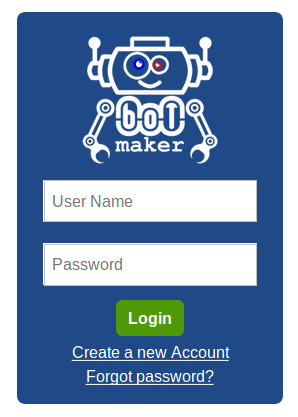
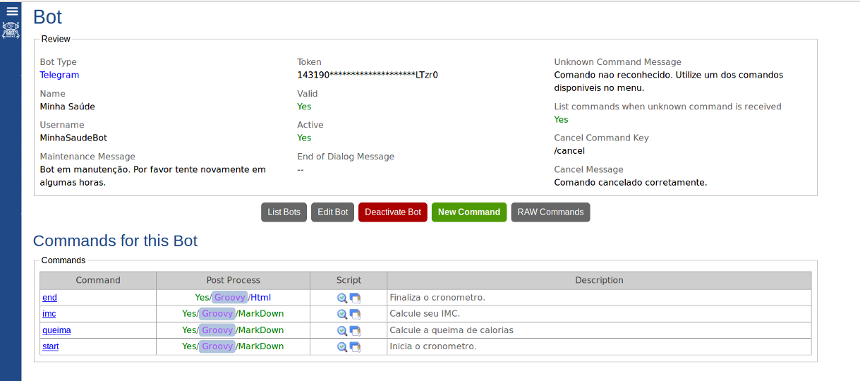

# BotMaker
*Botmaker* é um sistema server-side desenvolvido para criar, administrar e manter Bots na web. Os Bots interagem de forma automatizada com os usuários

## No *BotMaker*, um Bot pode ter um ou mais comandos. Os comandos são, por sua vez, acessados pelos usuários.

## É possível programar o comportamento de cada comando do Bot por meio de uma interface agradavel. 
A tela abaixo mostra o *Script Editor* nativo do *BotMaker*, uma tela agradável para programar e testar seu comando. O BotMaker suporta programação em Javascript, Groovy e em breve Phyton!

## Cada usuário pode definir suas preferências dentro do *BotMaker*.

